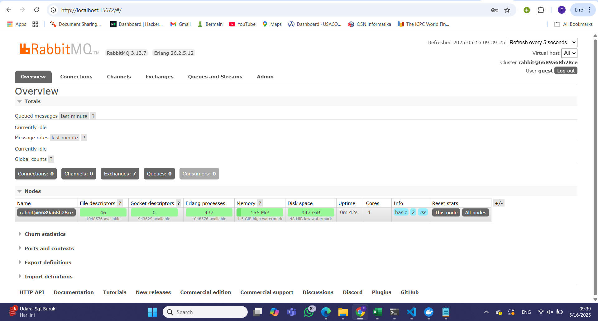
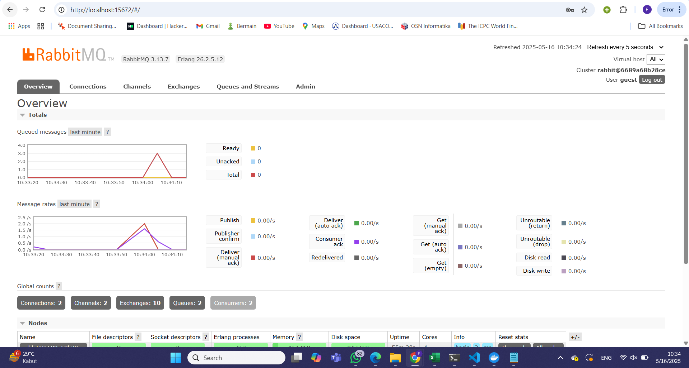

a. jumlah data yang dikirim oleh program adalah 5
b. artinya adalah baik publisher maupun subscriber terhubung ke server RabbitMQ yang sama

Ketika saya menjalankan perintah cargo run pada publisher, program akan mengirim 5 buah event bertipe UserCreatedEventMessage ke message broker (RabbitMQ).
Setiap event berisi data seperti user_id dan user_name.
Kemudian, program subscriber yang sudah aktif sebelumnya akan menerima dan memproses semua event tersebut melalui queue bernama user_created.

Lonjakan (spike) yang terlihat pada chart menunjukkan adanya peningkatan jumlah pesan yang tiba-tiba di message broker.

Spike ini terjadi setiap kali saya menjalankan kembali publisher dengan cargo 

Artinya, ada 6 event yang dikirim, namun belum semuanya diproses oleh subscriber karena proses yang lambat (1 detik per pesan).

Setiap terminal subscriber memproses sebagian pesan. Ini menandakan bahwa beban pemrosesan terbagi rata, tidak hanya dilakukan oleh satu subscriber saja.
Dengan subscriber lebih dari satu, maka pemrosesan menjadi lebih cepat, dan spike pada antrean menjadi lebih kecil atau cepat menurun.